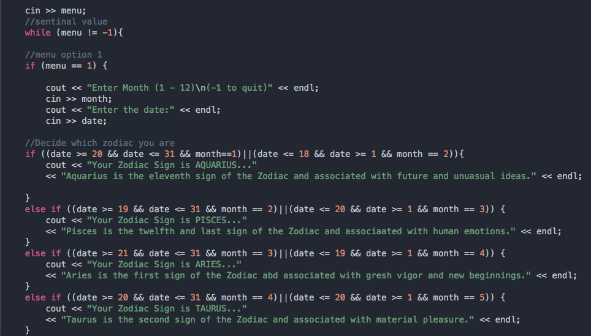

# Cpp-Project
Our project wanted to let users see what their astrology and chinese zodiacs. We used strings and various functions to allow our
code to look and fun flawlesly. We programmed a simple menu to allow the user to choose between both zodiacs. Skyler Wisdom
Jacob Palmer contributed to this project for our C++ class.

